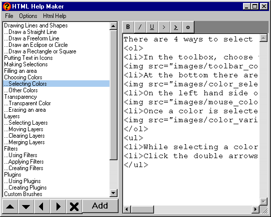



## HTML Help Maker

### Description

I was asked to write a Help file for CozIcon(my icon editor) but I wanted to include it on my website (http://cozicon.onlies.net/). I aslo didn't want to write the whole thing out in notepad so this is what I came up with. HTML Help Maker will allow you to build a custom Table of Contents and edit an html string corresponding to each selection. You can add a html template that will be generated with the html code from what you entered. Try it out.
 
### More Info
 

             |
---                |---
**Submitted On**   |2005-04-17 10:51:02
**By**             |[DoWnLoHo](https://github.com/Planet-Source-Code/PSCIndex/blob/master/ByAuthor/downloho.md)
**Level**          |Intermediate
**User Rating**    |4.3 (13 globes from 3 users)
**Compatibility**  |VB 6\.0
**Category**       |[Complete Applications](https://github.com/Planet-Source-Code/PSCIndex/blob/master/ByCategory/complete-applications__1-27.md)
**World**          |[Visual Basic](https://github.com/Planet-Source-Code/PSCIndex/blob/master/ByWorld/visual-basic.md)
**Archive File**   |[HTML\_Help\_1877764172005\.zip](https://github.com/Planet-Source-Code/downloho-html-help-maker__1-60059/archive/master.zip)

